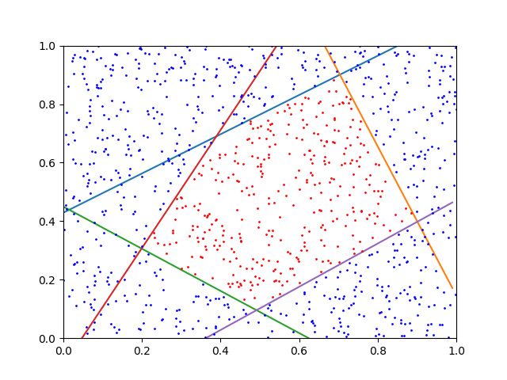

# polly
Implementation of Kwek &amp; Pitt (1998) polynomial time randomized algorithm for PAC-learning polytopes. One of my favorite geometrically elegant machine learning algorithms!

Paper: http://citeseerx.ist.psu.edu/viewdoc/download?doi=10.1.1.30.7509

Algorithm overview:
1. Sample points from any distribution in the (unit) positive orthant.
2. Use an oracle to label those points.
3. Calculate a ball guaranteed to be inside the polytope.
4. Select a "center" from inside the ball.
5. For every negatively labeled point, find a "close" point (called a surrogate) to the polytope, relative to the center.
6. Use the surrogates to "blame" each negatively labeled point on a certain hyperplane. Create clusters for the points which are "blamed" on the same hyperplane.
7. Use linear programming to find a hyperplane separating each cluster from the positively labeled points.
